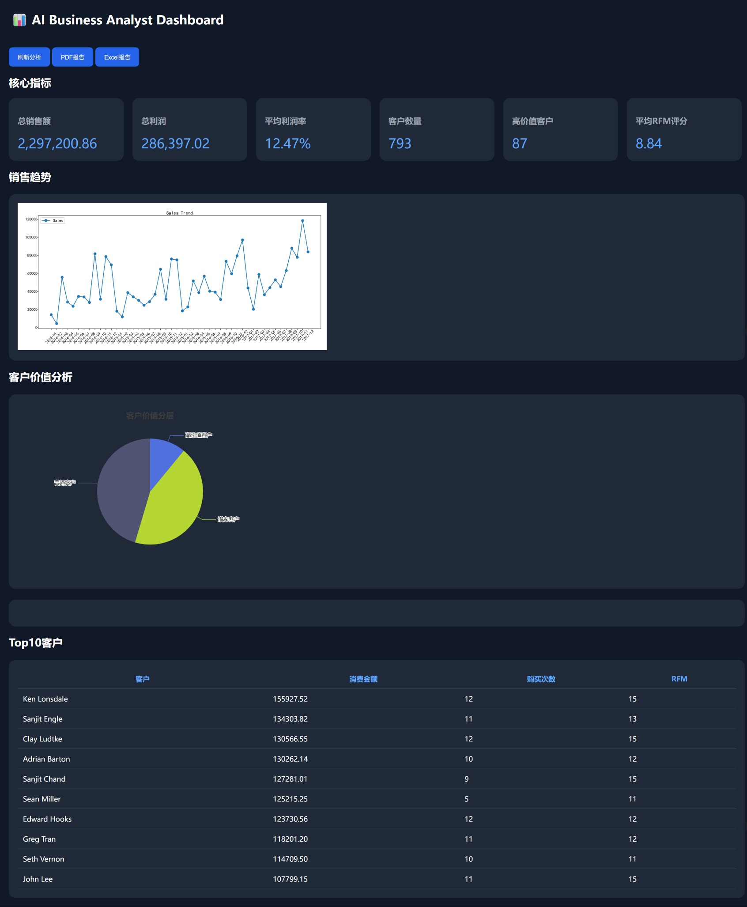
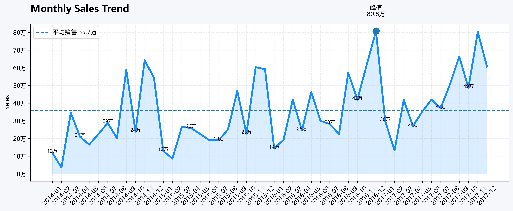
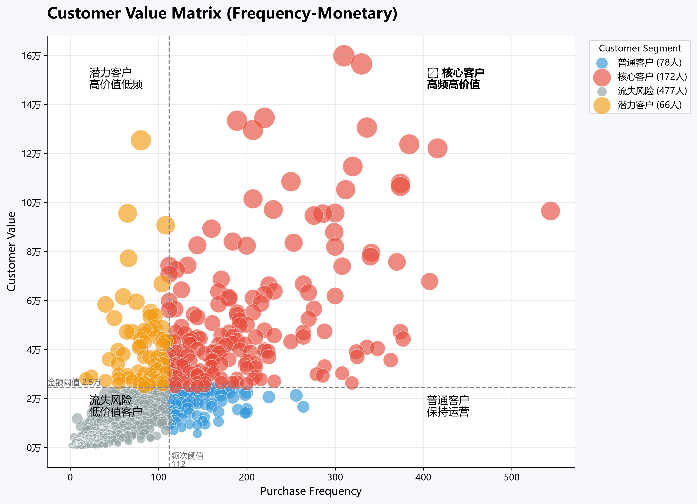
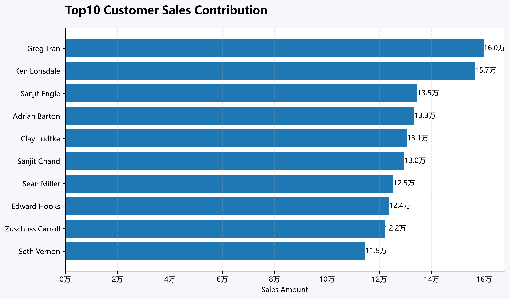
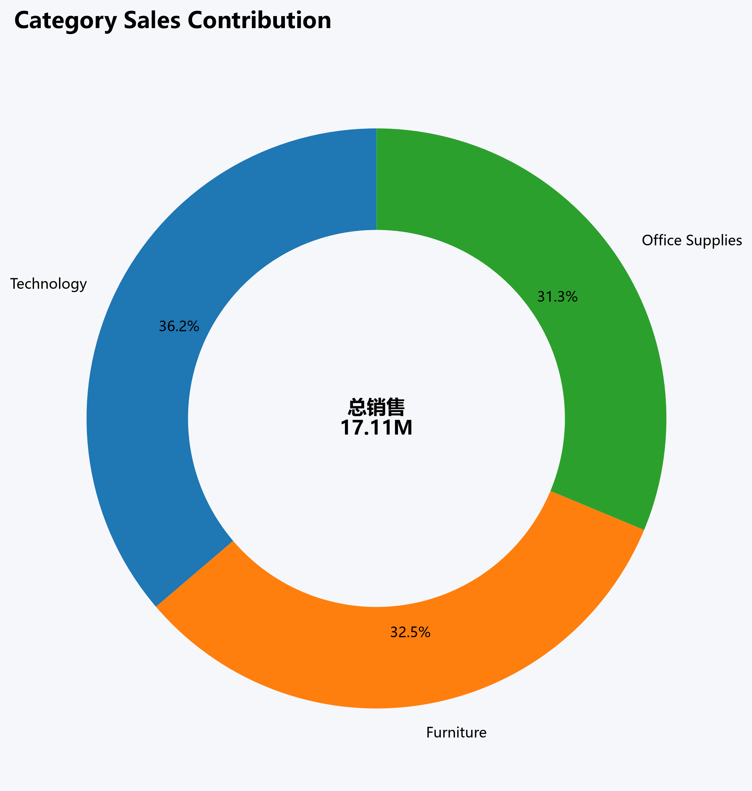
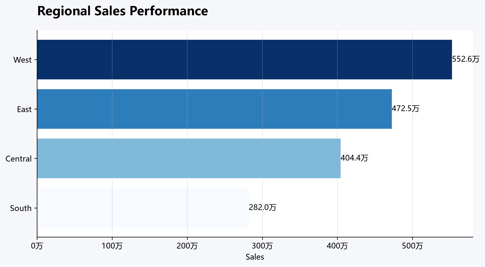
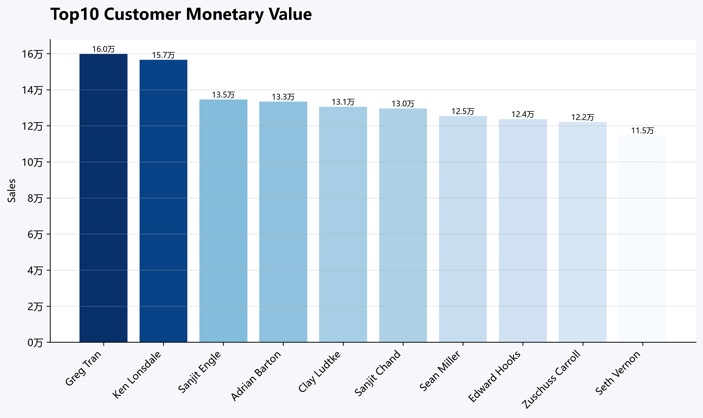
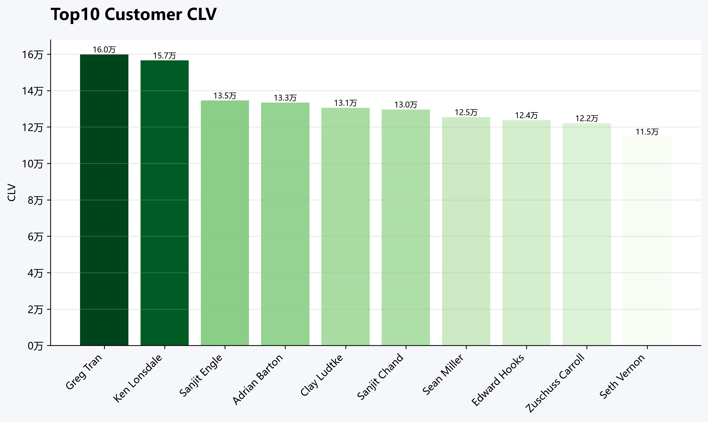

# 🤖 AI Business Analyst Agent

> 基于 LangGraph + LLM + SQL + Python 构建的智能商业分析 Agent，实现从自然语言问题到自动分析报告生成。

## 📊 Dashboard Preview





---

# 📌 项目简介


传统商业分析流程通常需要：

```
业务需求
 ↓
SQL查询
 ↓
Excel整理
 ↓
Python分析
 ↓
图表制作
 ↓
人工撰写报告
```

整个过程耗时较长，并且依赖分析人员经验。


本项目基于 **AI Agent 工作流**，利用大语言模型理解业务问题，自动完成：

```
用户自然语言问题

        ↓

LangGraph Agent

        ↓

SQL自动生成

        ↓

数据库查询

        ↓

数据分析

        ↓

RFM客户价值分析

        ↓

BI风格可视化

        ↓

AI商业洞察

        ↓

自动生成分析报告

        ↓
Excel / HTML / PDF输出
```


最终输出：

- Markdown报告
- HTML报告
- PDF报告
- Excel分析文件


实现从数据查询到商业决策支持的自动化分析流程。


---

# ✨ 核心功能


## 1. 自然语言驱动数据分析


用户无需编写SQL，只需要输入业务问题。


例如：

```
分析客户价值和销售趋势
```


Agent 自动完成：

- 理解业务需求
- 生成SQL查询
- 执行数据库操作
- 调用Python分析工具
- 分析业务指标
- 输出可视化结果


---

# 2. LangGraph Agent 架构


系统采用基于工具调用的 Agent 工作流：

```
User Question

 ↓

LangGraph Agent

 ↓

SQL Query Tool

 ↓

SQLite Database

 ↓

Analysis Tools

 ↓

Visualization

 ↓

Report Generation

 ↓

PDF / Excel
```


核心模块：

| 模块             |功能|
|----------------|-|
| SQL Agent      |自然语言生成SQL|
| Query Tool     |执行数据库查询|
| Sales Analysis |销售指标计算|
| RFM Analysis   |客户价值分析|
| Visualization  |自动生成图表|
| Report Export  |PDF/Excel报告生成|

---

# 3. 数据分析能力

### 销售分析
系统自动计算：
- 总销售额
- 总利润
- 平均月销售额
- 平均利润率
- 月销售趋势
- 销售峰值月份

### 客户价值分析

#### RFM客户价值模型
采用经典 RFM 模型：

|指标| 含义 |
|-|----:|
|Recency|  最近一次购买时间 |
|Frequency|      购买频率 |
|Monetary|    累计消费金额 |

实现：
- 客户价值评分
- 客户分层
- 高价值客户识别
- 客户生命周期价值(CLV)
- Top客户排名

通过RFM评分，实现客户分层：


|客户类型|数量|
|-|-:|
|高价值客户|217|
|潜力客户|295|
|普通客户|281|

---
# 4. BI风格Dashboard

系统自动生成商业分析Dashboard

包含：

## KPI指标

- 总销售额
- 总利润
- 平均利润率
- 客户数量


## 销售趋势分析
通过面积趋势图展示企业销售变化。

包含：

- 月销售趋势
- 平均销售水平
- 销售峰值识别
- 销售低谷识别



## RFM客户价值矩阵
利用RFM模型构建客户价值四象限。

分析：

- 核心客户
- 潜力客户
- 普通客户
- 流失风险客户




## Top10识别贡献最高客户。
按照累计消费金额排名。


用于：

- 高价值客户维护
- 精准营销
- VIP客户运营




## 产品类别销售贡献
分析不同产品类别对于整体销售的贡献。




## 地区销售表现
分析不同区域市场销售能力。




## Top10客户消费价值
按照累计消费金额排名。


用于：

- 高价值客户维护
- 精准营销
- VIP客户运营




## Top10客户生命周期价值 CLV
预测客户长期价值。


用于：

- 客户运营优先级排序
- 营销资源分配





---

# 5. 自动生成商业分析报告
系统支持多种格式输出：


## Markdown

```
customer_sales_report.md

适用于：
- GitHub展示
- 数据分析结果阅读
```


## HTML

```
customer_sales_report.html
```


## PDF

```
customer_sales_report.pdf
```


## Excel


```
customer_sales_analysis.xlsx
```


Excel包含多个分析Sheet：


```
Summary

Monthly Sales

Customer RFM

Top10 Customer

Category Sales

Region Sales

Raw Data

```

支持：

- Excel二次分析
- 数据复盘
- BI导入


---

# 📊 数据集


项目采用经典 Superstore 销售数据。

数据经过数据库结构化处理：


```
Orders

Customers

Products
```


数据规模：


|指标|数量|
|-|-:|
|客户数量|793|
|订单数量|74378|
|销售额|17,114,928.46 元|


---

# 🏗️ 项目结构


```
AI-Business-Analyst-Agent


AI-Business-Analyst-Agent

│
├── agents
│   └── sql_agent.py
│── api
│   ├── main.py
│   └── agent_api.py
├── nodes
│   ├── sql_node.py
│   ├── execute_node.py
│   ├── analysis_node.py
│   ├── visualization_node.py
│   ├── insight_node.py
│   ├── report_node.py
│   ├── excel_export_node.py
│   └── pdf_export_node.py
│
├── database
│   └── superstore.db
│
├── visualization
│   ├── dashboard.png        
│   ├── monthly_sales_trend.png
│   ├── rfm_3d_scatter.png
│   ├── top10_customer_sales.png
│   ├── top10_customer_value.png
│   ├── top10_customer_clv.png
│   ├── category_sales.png
│   └── region_sales.png
│
├── reports
│   ├── customer_sales_report.md
│   ├── customer_sales_report.html
│   ├── customer_sales_report.pdf
│   └── customer_sales_analysis.xlsx
│
├── data
│   └── analysis_result.json
│
├── tools
│   └── create_dashboard.py
│
├── requirements.txt
│
├── README.md
│
└── .gitignore

```


---

# 🛠️ 技术栈


## AI Agent

- LangGraph
- LangChain
- LLM


## 数据处理

- Python
- Pandas
- NumPy


## 数据库

- SQLite
- SQL


## 数据可视化

- Matplotlib


## 文件生成

- Markdown
- HTML
- OpenPyXL
- ReportLab


---

# 🚀 项目运行


## 1. 创建环境


```bash
conda create -n langgraph python=3.10

conda activate langgraph
```


---

## 2. 安装依赖


```bash
pip install -r requirements.txt
```

---

## 3. 配置API

```
.env

OPENAI_API_KEY=your_key
```

## 4.启动：

```
uvicorn api.main:app --reload
```
## 5.访问：
```
http://127.0.0.1:8000/docs
```

---

# ⭐ 项目亮点


## AI Agent自动化分析

将传统：
```
SQL
+
Excel
+
Python
+
人工报告
```
转变为：
```
自然语言
+
AI Agent
+
自动分析
```

## 商业分析能力

结合：

- SQL数据查询
- RFM客户分群
- CLV价值评估
- BI可视化
- 自动报告生成

## 工程化能力

项目包含：

- FastAPI接口
- 数据库管理
- Agent工具调用
- 自动报告生成
- Dashboard展示

---

# 🔮 后续优化


- [ ] 接入 MySQL / PostgreSQL
- [ ] 增加销售预测模型
- [ ] 增加异常检测Agent
- [ ] 增加RAG企业知识库
- [ ] 多Agent协作分析

---

# 👩‍💻 Author

AI Agent Developer | Data Analyst
Building intelligent data analysis systems with LLM, LangGraph and Python

